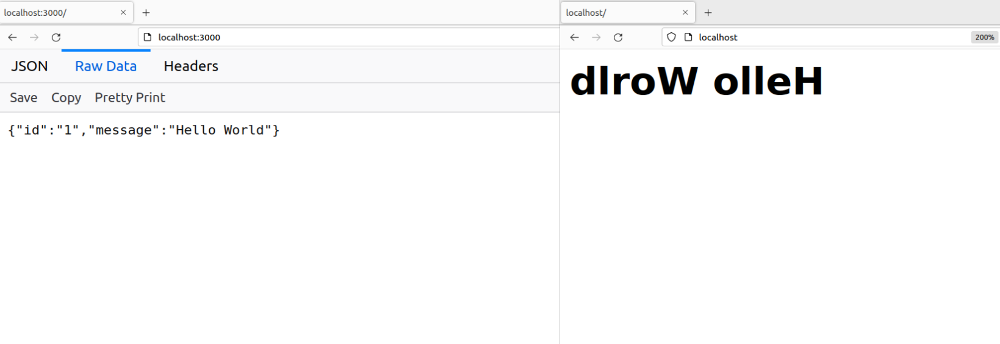

## json-server-app
- the first app is nodejs exposing a json document when visited with an HTTP client.
- the second app utilizes the firest app and display a reversed message text
- Dockerize the apps 
- automate deployment of the apps (json-server, reversed-json-server and nginx) using script.sh
- scirpt k8s.sh contains instructions to deployment json-server on kubernetes from docker hub and expose svc to display it from the browser
- to remove all running container run: $ docker container rm -f $(docker container ps -q) 

